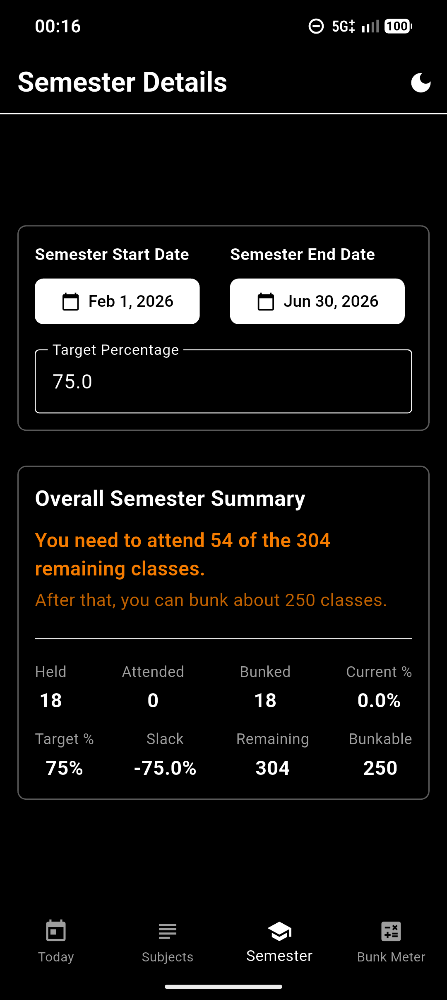
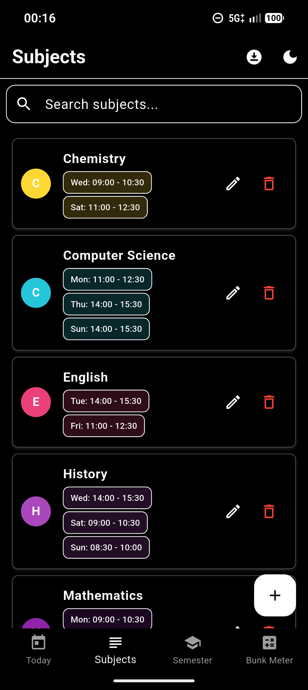
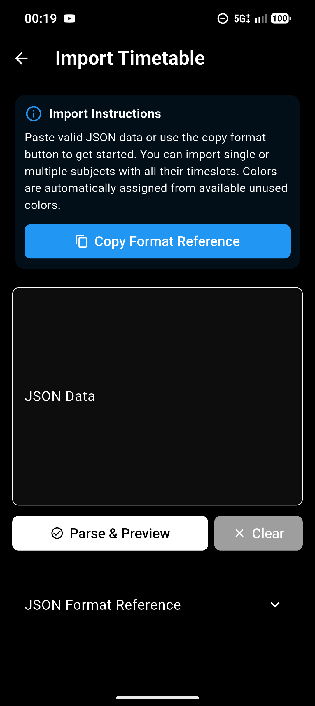
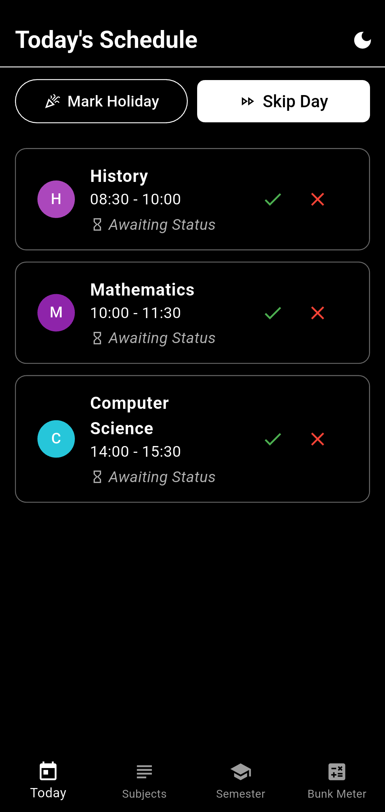
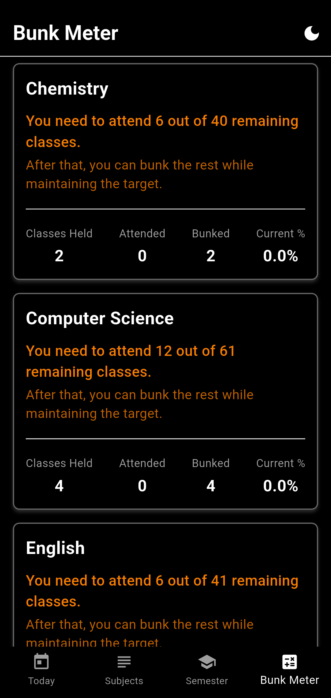

# AttendMate

**AttendMate** is an attendance tracking app designed for students to manage their class attendance, calculate bunking capacity, and maintain their target attendance percentage throughout the semester.


---

## 📱 Overview

AttendMate helps students stay on top of their attendance by providing intelligent tracking, predictions, and notifications. Whether you want to know how many classes you can safely skip or how many you need to attend to meet your target, AttendMate has you covered.


---

## ✨ Key Features

### 📅 Semester Management
- Set up semester with start and end dates
- Define target attendance percentage for the entire semester
- Automatic semester status tracking (not started, active, ended)



### 📚 Subject Management
- Add unlimited subjects with custom names and optional acronyms
- Assign unique colors to each subject for easy identification
- Set individual target attendance percentages per subject
- Create flexible weekly schedules with multiple time slots per subject
- Edit or delete subjects anytime



### 📥 Timetable Import
- Bulk import subjects via JSON format
- Automatic color assignment from available palette
- Preview subjects before importing
- Built-in JSON format reference and validation



### 📆 Today's Schedule
- View all classes scheduled for today
- Quick attendance marking with Present/Absent buttons
- Visual status indicators (Attended, Absent, Cancelled, Awaiting)
- Mark entire day as holiday (cancels all classes)
- Skip entire day (marks all classes as absent)
- Time-sorted class list for easy reference



### 📊 Bunk Meter (Predictions)
- **For subjects above target:** Shows exactly how many classes you can safely bunk
- **For subjects below target:** Calculates how many classes you need to attend
- **Target unreachable warning:** Alerts when target percentage is impossible to achieve
- Real-time statistics: Classes held, attended, bunked, current percentage
- Intelligent sorting: Subjects needing attention appear first
- Semester end date awareness



### 🔔 Notifications
- Automatic notifications when classes end
- Quick action buttons: "Mark Present" and "Mark Absent" directly from notification

### 🎨 Theme Support
- System theme following (automatic switching)

### 💾 Data Persistence
- All data stored locally using SQLite database
- No internet connection required

---

## 🎯 How It Works

### Setting Up
1. **Create a Semester:** Define your semester start date, end date, and target attendance percentage
2. **Add Subjects:** Create subjects with names, colors, and weekly schedules
3. **Import (Optional):** Bulk import multiple subjects using JSON format

### Daily Usage
1. **Check Today's Schedule:** View all classes for the day
2. **Mark Attendance:** Tap Present or Absent buttons for each class
3. **Use Notifications:** Mark attendance directly from notification action buttons
4. **Special Days:** Mark holidays or skip entire days with one tap

### Monitoring Progress
1. **Bunk Meter:** Check how many classes you can bunk or need to attend
2. **Real-time Stats:** View attended, bunked, and current percentage for each subject
3. **Alerts:** Get warnings when target percentage becomes unreachable

---

## 📋 Use Cases

### For Students Who Want to Maintain Attendance
- Set your college's minimum attendance requirement (e.g., 75%)
- Track attendance for all subjects in one place
- Get alerts when you're falling behind

### For Students Who Want to Optimize Bunking
- Know exactly how many classes you can skip
- Plan your bunks strategically across the semester
- Avoid last-minute attendance panic

### For Organized Students
- Import entire timetable at once using JSON
- Color-code subjects for visual organization
- Use notifications to never forget to mark attendance

---

## 🔧 Technical Highlights

- **Platform:** Android (Flutter-based)
- **Database:** SQLite for local storage
- **Notifications:** Flutter Local Notifications with action buttons
- **State Management:** Provider pattern
- **UI Framework:** Material Design 3
- **Fonts:** Google Fonts (Oswald, Roboto, Open Sans)

---

## 📖 User Guide

### JSON Import Format
To bulk import subjects, use this JSON structure:

```json
{
  "subjects": [
    {
      "name": "Mathematics",
      "acronym": "MTH",
      "schedule": [
        {
          "day": "monday",
          "startTime": "09:00",
          "endTime": "10:30"
        },
        {
          "day": "wednesday",
          "startTime": "14:00",
          "endTime": "15:30"
        }
      ]
    }
  ]
}
```

**Valid days:** monday, tuesday, wednesday, thursday, friday, saturday, sunday  
**Time format:** HH:MM (24-hour)  
**Acronym:** Optional short name for subjects

---

## 🚀 Getting Started

### Download
Download the latest APK from the [Releases](../../releases) section.

### Installation
1. Download the APK file
2. Enable "Install from Unknown Sources" in Android settings
3. Open the APK and install
4. Grant notification permissions for best experience

### First Launch
1. Open AttendMate
2. Navigate to "Semester" tab
3. Set up your semester details
4. Add subjects or import timetable
5. Start tracking attendance!

---

## 📝 Version Information

**Current Version:** 1.0.0  
**Release Date:** February 2026  
**Minimum Android Version:** Android 5.0 (API 21)

See [CHANGELOG.md](CHANGELOG.md) for version history.  
See [RELEASE_NOTES.md](RELEASE_NOTES.md) for detailed v1.0.0 release information.  
See [FEATURES.md](FEATURES.md) for complete feature list.

---

## 🤝 Support

For issues, questions, or feature requests, please open an issue in this repository.

---

## 📄 License

This project is licensed under a Custom Freeware License.

---

## 🙏 Acknowledgments

Built with Flutter and Material Design 3 principles for a modern, intuitive user experience.

---

**Made with ❤️ for students who want to stay organized**
