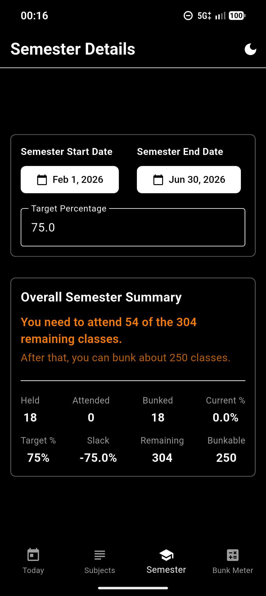
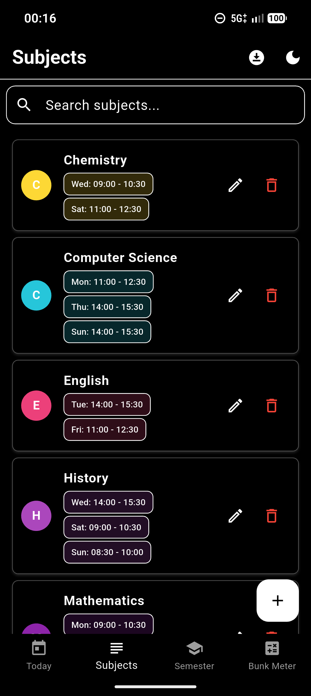
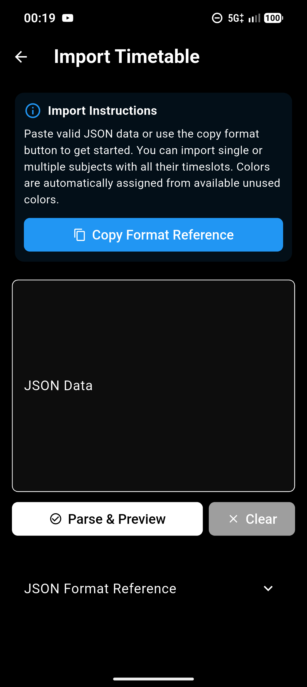
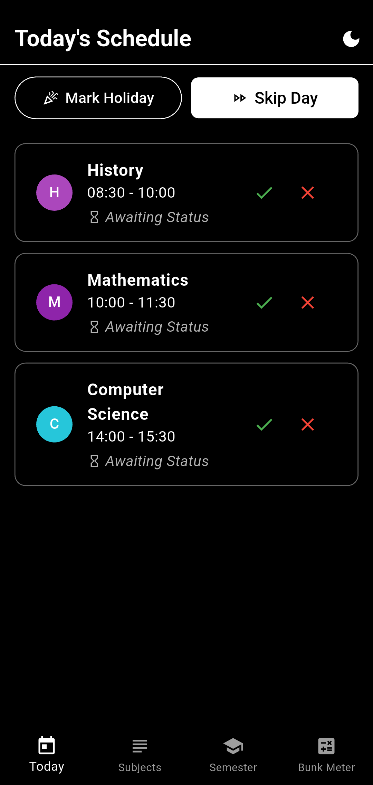
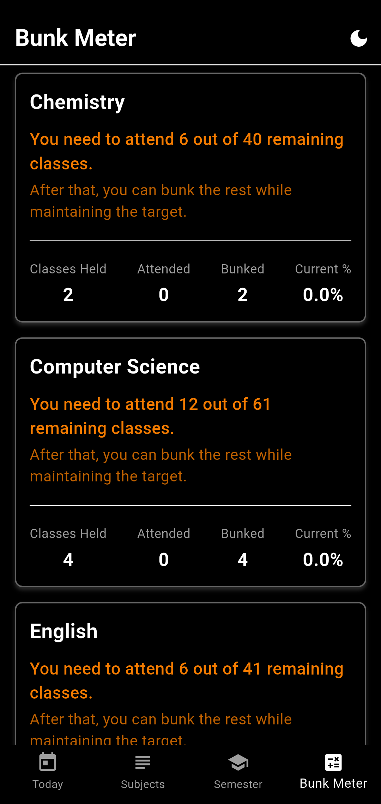

# AttendMate 2.0

**AttendMate 2.0** is an open-source attendance tracking app for students — track classes, calculate bunking capacity, auto-log attendance via geofencing, plan future leaves, and stay on top of your attendance target throughout the semester.


---

## 📱 Overview

AttendMate gives you a clear picture of where you stand in every subject — how many classes you can still bunk, how many you need to attend to recover, and how future leaves will impact your target. All data stays on your device with no accounts required.

---

## ✨ Key Features

### 📅 Semester Management
- Create a semester with start date, end date, and target attendance percentage
- Automatic status detection — tracks whether your semester is upcoming, active, or ended
- Edit semester details anytime



### 📚 Subject Management
- Add unlimited subjects with custom names, acronyms, colors, and per-subject attendance targets
- Acronyms auto-generated from subject initials if left empty (filler words like "and", "of", "the" are skipped)
- 10 colors available, auto-assigned to keep subjects visually distinct
- **Collapsible subject cards** — collapse to just the name and acronym, expand for full schedule details
- Edit or delete subjects anytime



### 📥 Timetable Import
- Bulk import all your subjects and schedules at once using a simple JSON format
- Preview what will be imported before confirming
- Automatic color assignment during import
- Built-in format reference with copy-to-clipboard support



### 📆 Today's Schedule
- View all classes for today, sorted by time
- Mark each class as **Present** or **Absent** with customizable swipe gestures or one tap; unmark to revert to _Awaiting_
- **Mark Today as Present** — marks all pending classes at once
- Mark entire day as **Holiday** (cancels all classes, excluded from attendance calculations)
- **Skip Day** — marks all classes absent
- When a day is a holiday, classes are still visible with individual **Holiday** actions per class
- Auto end-of-day: at 10 PM, any still-unmarked class is automatically marked Present



### 📊 Bunk Meter
- Per-subject predictions: how many classes you can safely bunk, or how many you must attend
- Clear warning when a subject's target is no longer achievable
- Statistics per subject: classes held, attended, bunked, and current percentage
- **Collapsible bunk meter cards** — collapse for a quick status summary, expand for full detail
- **Search** — filter subjects by name in real time



### 📅 Attendance Calendar
- Full-semester month view with colour-coded dates for each attendance state
- Swipe left/right to navigate between months
- Tap any past date to review its classes and update attendance from a bottom sheet
- Bulk day actions: Mark Present, Skip, Holiday
- Day detail view with classes sorted by time; swipe to jump to the next/previous day with classes
- Upcoming dates shown as read-only

### 🔔 Notifications
- Notification fires when each class ends with **Mark Present** and **Mark Absent** action buttons
- Mark attendance directly from the notification — no need to open the app
- Tap notification to navigate straight to Today's Schedule
- Confirmation notifications display exact subject names and persist until dismissed
- Skips notifications for already-marked classes; 5-minute grace period for very recent classes
- Exact alarm scheduling with full timezone awareness

### 🔄 In-App Updates
- Automatic update check on launch; manual check available in the More tab
- In-app update dialog with "What's New" highlights
- Download and install the update directly from within the app

### ⋯ More Tab
- Switch between 12-hour (AM/PM) and 24-hour time format — applied across the whole app
- Switch between Material Dialog and Scroll Wheel time picker styles
- Manage campus locations & geofencing coordinates
- View current app version and build number
- In-app **Setup Guide** — swipeable section-by-section walkthrough with a table of contents
- **What's New** — bundled release notes viewable in-app
- Submit a feature request or bug report directly on GitHub

### 🎨 Theme Support
- Light mode (white), dark mode (true black, AMOLED-friendly), and System (follows device setting)
- Theme preference saved across restarts

---

## 🆕 What's New in AttendMate 2.0

- 📊 **Redesigned Attendance Calendar UI & Filtering**: Updated calendar UI style with modern day tiles, status filtering (`Present`, `Absent`, `Cancelled`, `Holiday`, `Planned Leave`), and a quick "Today" return shortcut.


- 🧮 **Bunk Calculator**: Simulate bunking $N$ or attending $M$ future classes for any subject to project your exact attendance percentage before making a decision.


- 📅 **Leave Planner & Calendar Sync**: Plan future trips or medical leaves and automatically sync lecture cancellations/restorations with Google Calendar and Device System Calendars.

- 📍 **Geofenced Auto-Attendance & Interactive Google Maps**: Save campus room locations on an interactive Google Map with a 25-meter radius geofence overlay. The app automatically logs you as **Present** 5 minutes after class starts when you're at your classroom.

- 💾 **Rolling Semester Backup System**: Automatic 3-backup rolling snapshot rotation and manual JSON export/restore to protect your attendance data against accidental deletion or app uninstalls.

### 💾 Privacy & Data
- All data stored locally using SQLite — no accounts, no cloud, no tracking
- Works fully offline
- View our [Privacy Policy](https://attendmate.venkatpiyush.xyz/privacy.html) and [Terms of Service](https://attendmate.venkatpiyush.xyz/terms.html)

---

## 🎯 How It Works

### Setting Up
1. **Create a Semester:** Set start date, end date, and your target percentage
2. **Add Subjects:** Name, colour, acronym, and weekly schedule for each subject
3. **Import (Optional):** Paste a JSON timetable to add all subjects at once
4. **Set Locations (Optional):** Save classroom locations with Google Maps coordinates for auto-attendance

### Daily Usage
1. Open **Today's Schedule** and mark each class as Present or Absent
2. Or mark attendance directly from the notification that fires after class ends
3. Or let geofenced auto-attendance log your presence automatically when in class
4. Use **Skip Day** or **Mark as Holiday** for special days

### Monitoring Progress
1. Check the **Bunk Meter** tab to see how many classes you can bunk per subject
2. Use the **Bunk Calculator** to project future bunk scenarios
3. Review the **Calendar** for a full-semester overview
4. Plan upcoming trips in the **Leave Planner**

---

## 📖 JSON Import Format

```json
{
  "subjects": [
    {
      "name": "Mathematics",
      "acronym": "MTH",
      "schedule": [
        { "day": "monday",    "startTime": "09:00", "endTime": "10:30" },
        { "day": "wednesday", "startTime": "14:00", "endTime": "15:30" }
      ]
    }
  ]
}
```

**Valid days:** `monday` `tuesday` `wednesday` `thursday` `friday` `saturday` `sunday`  
**Time format:** `HH:MM` (24-hour)  
**Acronym:** optional — auto-generated from initials if omitted

---

## 🚀 Getting Started

### Download
Download the latest APK from the [Releases](../../releases) section.

### Installation
1. Download **AttendMate-v2.0.0.apk**
2. Enable **Install from Unknown Sources** in Android settings if prompted
3. Open the APK and install
4. Grant notification and location permissions for the best experience

### First Launch
1. Open AttendMate — the interactive app tour appears on first launch
2. Go to the **Semester** tab and create your semester
3. Add subjects or use the JSON import
4. Start marking attendance from the **Today** tab

---

## 🔧 Technical Details

| | |
|---|---|
| **Platform** | Android (Flutter) |
| **Min Android** | 7.0 (API 24) |
| **Database** | SQLite (local, offline) |
| **State Management** | Provider |
| **UI Framework** | Material Design 3 |
| **Maps & Location** | Google Maps SDK & Geolocator |
| **Notifications** | Flutter Local Notifications |
| **Background tasks** | WorkManager |

---

## 🏁 Signing Off — The Final Chapter

AttendMate started as my very first Flutter project, born out of personal frustration with clunky, ad-ridden attendance trackers. Five and a half months later, **AttendMate 2.0.0** represents the exact vision I set out to build—a feature-complete, ad-free, local-first, and automated attendance ecosystem.

With the launch of **v2.0.0**, core feature development for AttendMate has officially reached its final milestone. Every planned capability—from background geofencing and predictive bunk calculations to automated calendar sync and rolling backups—is now fully built, tested, and shipped.

### 💚 What Happens Next & Community Contributions
- **100% Free & Ad-Free Forever:** The app will remain completely free, ad-free, and fully functional for all current and future semesters.
- **Open Source & Contributions Welcome:** The codebase remains 100% open-source on GitHub under AGPL-3.0. Anyone is welcome to contribute, open Pull Requests, report issues, or request new features—I will always be happy to review PRs, look into issues, and push future release updates!
- **Stable & Self-Contained Utility:** The project stands as a complete, stable, and reliable tool for students everywhere.

Thank you to everyone who tested early builds, reported bugs, gave feedback, and supported this journey from v1.0 to v2.0! The app is yours now—use it to safeguard your attendance and stress less about bunks! 🎓🚀

---

## 📝 Version Information

**Current Version:** 2.0.0  
**Release Date:** July 22, 2026  
**Minimum Android Version:** Android 7.0 (API 24)

See [CHANGELOG.md](CHANGELOG.md) for full version history.

---

## 🤝 Contributing

AttendMate is open source — contributions, bug reports, and feature suggestions are welcome.  
See [CONTRIBUTING.md](CONTRIBUTING.md) to get started.

For questions or support, please [open an issue](../../issues/new).

---

## 📄 License

This project is licensed under the [AGPL-3.0](LICENSE).
